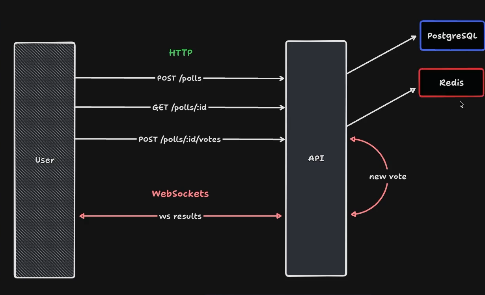

# WebSockets Polls

Um sistema de votação em tempo real onde os usuários podem criar uma enquete e outros usuários podem votar. O sistema gera um ranking entre as opções e atualiza os votos em tempo real.

## Configuração para rodar
 
- Clone o repositório 
- Instalar dependências (`npm i`)
- Configure o Docker e Redis (`docker compose up -d`)
- Copie o arquivo `env example` e cole no (`.env`)
- Rode a aplicação (`npm run dev`)
- Teste a aplicação (Durante a aplicação usei via terminal, mas recomendo usar o [Postman](https://www.postman.com/))

## Rotas

### POST `/polls`

Cria uma votação.

#### Request body

```json
{
  "title": "Qual o melhor framework do Node",
  "options": [
    "Hari.JS",
    "Nest.JS",
    "Express",
    "Fastify"
  ]
}
```
#### Response body

```json
{
  "pollId": "10100c94-ded8-4b87-9954-00b4fbabb58e"
}
```

### GET `/polls/:pollId`

Retorna a resposta de uma única votação.

#### Response body

```json
{
	"poll": {
		"id": "10100c94-ded8-4b87-9954-00b4fbabb58e",
		"title": "Qual o melhor framework do Node",
		"options": [
			{
				"id": "4af3fca1-91dc-4c2d-b6aa-897ad5042c84",
				"title": "Hari.JS",
				"score": 1
			},
			{
				"id": "780b8e25-a40e-4301-ab32-77ebf8c79da8",
				"title": "Nest.JS",
				"score": 0
			},
			{
				"id": "539fa272-152b-478f-9f53-8472cddb7491",
				"title": "Express",
				"score": 0
			},
			{
				"id": "ca1d4af3-347a-4d77-b08b-528b181fe80e",
				"title": "Fastify",
				"score": 0
			}
		]
	}
}
```

### POST `/polls/:pollId/votes`

Adicione um voto a uma enquete específica.

#### Request body

```json
{
  "pollOptionId": "31cca9dc-15da-44d4-ad7f-12b86610fe98"
}
```

## WebSockets

### ws `/polls/:pollId/results`

#### Message

```json
{
  "pollOptionId": "da9601cc-0b58-4395-8865-113cbdc42089",
  "votes": 2
}
```
<br />

## Diagrama

Diagrama utilizado para construção da aplicação, o mesmo diagrama foi feito no [Excalidraw](https://excalidraw.com/)

<p align="justify">
  
</p>

<br />

## Tecnologias Usadas
- [Fastify](https://fastify.dev/)
- [Redis](https://redis.io/)
- [Docker](https://www.docker.com/)
- [WebSockets](https://github.com/fastify/fastify-websocket)


<!--START_SECTION:footer-->
<br />

## 🔗 Connect with me
[](https://linkedin.com/in/matheusgmello)
[](https://www.reddit.com/user/math7zw)
[](https://github.com/matheusgmello/)


<!--END_SECTION:footer-->